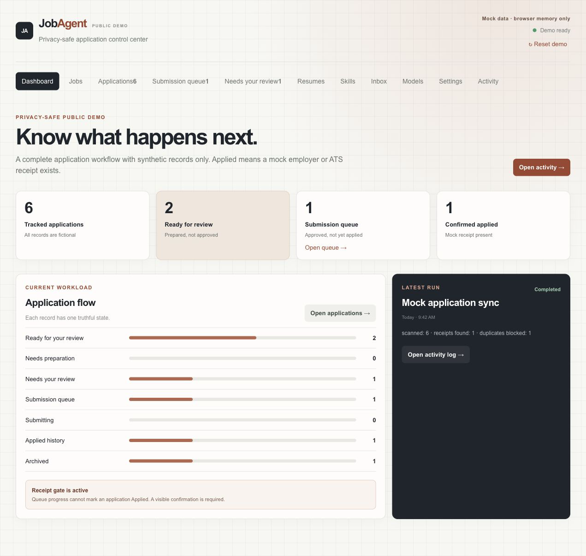
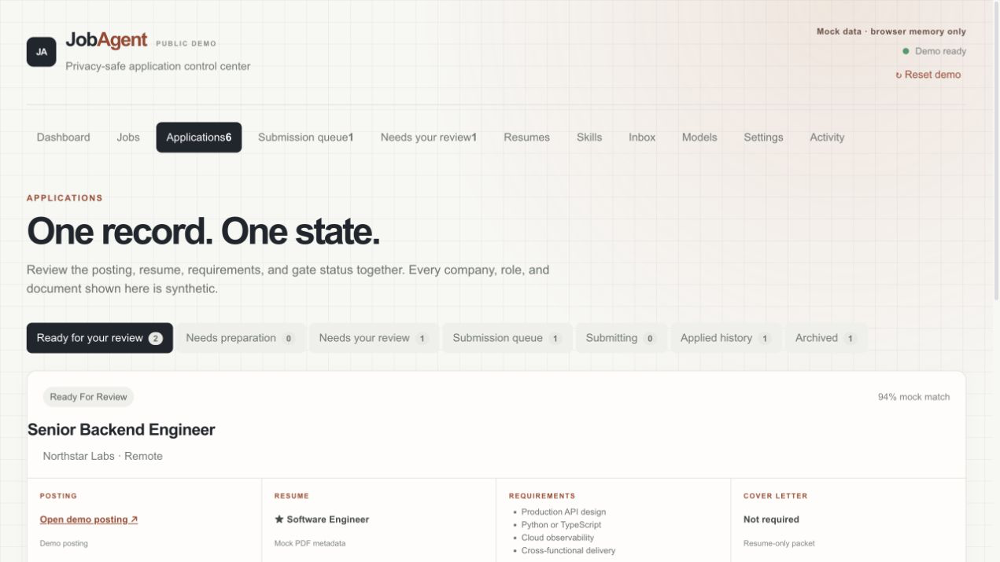
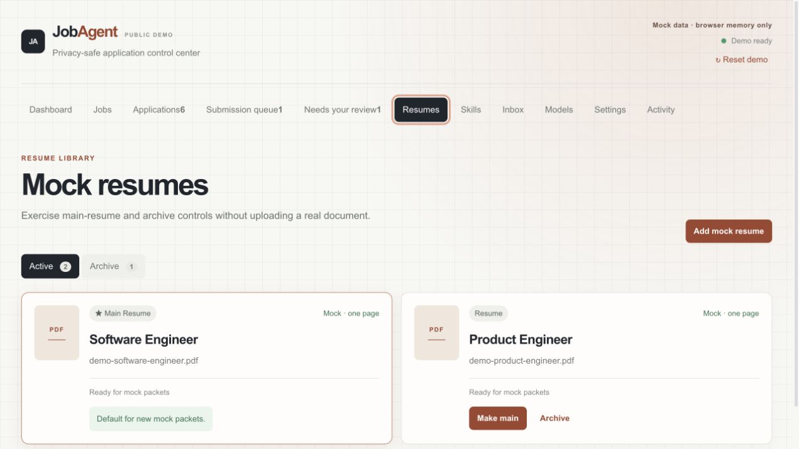

# JobAgent



JobAgent is a privacy-first job-search control center. This public build contains the complete product interface with fictional records and browser-memory interactions only.

[Open the public demo](https://rishva.up.railway.app/demos/jobagent/)

The same mock-only build is checked in at [`demo/index.html`](./demo/index.html) for GitHub Pages or local preview.

## Public demo safety

- No personal applications, resumes, skills, email, profile data, or employment history.
- No API keys, OAuth tokens, mailbox connections, uploads, or external writes.
- No application is submitted and no message is sent.
- Every company, role, receipt, filename, and activity record is synthetic.
- Demo changes stay in memory and reset on reload.
- Interview Prep, Briefs, and Interview Guide are intentionally excluded.

## Included features

- **Dashboard:** workflow counts, funnel, latest run, and receipt gate.
- **Jobs:** synthetic role matching, saving, dismissing, and draft actions.
- **Applications:** one-state workflow with posting, resume, requirements, cover-letter status, approval, and archive controls.
- **Submission queue:** approved packets remain separate from confirmed applications.
- **Evidence replay:** a synthetic ATS receipt demonstrates the exact evidence gate and append-only audit timeline without contacting an external system.
- **Needs your review:** unresolved questions can be answered once across matching mock records.
- **Resume library:** main-resume, archive, restore, and add-mock-resume interactions without file uploads.
- **Skills:** evidence-backed inventory, readiness labels, and claim guardrails.
- **Inbox:** synthetic triage and reply-draft interaction with sending disabled.
- **Models:** operator field guide for matching model and effort to a task.
- **Settings:** public-safe provider states and mock agent controls.
- **Activity:** visible mock runs, counts, and blockers.

## UI screenshots

| Application workflow | Mock resume library |
| --- | --- |
|  |  |

## Truthful workflow states

```text
Needs preparation
  -> Ready for your review
  -> Needs your review, when an answer is missing
  -> Submission queue
  -> Submitting
  -> Applied, only after a visible employer or ATS confirmation
```

An approval is permission to attempt a submission. It is not proof that the application was submitted. The duplicate gate keeps confirmed applications from being repeated.

The receipt contract requires confirmation text, an HTTP(S) source, and an
observed timestamp. Missing evidence produces a state conflict; repeating the
same receipt is idempotent.

## Run locally

Requirements: Node.js 18 or newer.

```bash
cd frontend
npm install
npm run dev
```

Open `http://127.0.0.1:5174/`. The interface uses the synthetic in-memory adapter in `frontend/src/api.js` and does not require the backend.

Build verification:

```bash
cd frontend
npm test
npm run build
cd ..
python3 -m unittest discover -s backend/tests -v
```

## Repository layout

```text
frontend/
  src/App.jsx                       Public demo shell and navigation
  src/api.js                        Synthetic in-memory data adapter
  src/components/WorkflowViews.jsx Workflow, queue, review, resume, skills, settings, activity
  src/components/Jobs.jsx           Synthetic job discovery interface
  src/components/Inbox.jsx          Synthetic inbox interface
  src/components/Models.jsx         Model and effort field guide
backend/                             Optional local FastAPI reference implementation
docs/                                Current UI screenshots
demo/                                Self-contained static mock build
```

## Privacy boundary

The public React app does not call `/api`. Its adapter returns fixed mock fixtures and keeps edits inside the current browser session. Provider inputs are disabled, resume upload is replaced with a synthetic card generator, inbox actions cannot send, and job links use `example.com`.

The optional backend is retained for local development. Do not expose a real-data configuration publicly without authentication, secret management, access controls, and a separate privacy review.
