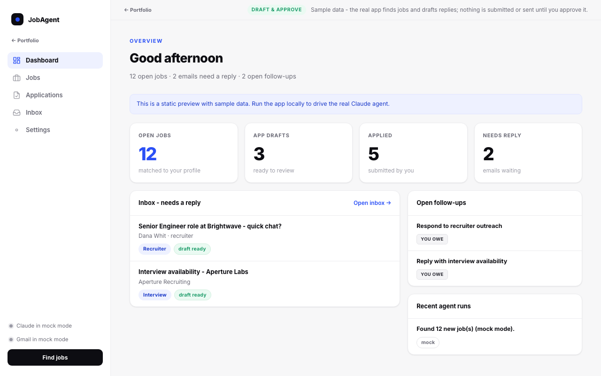

# JobAgent



A private, local-first job-search dashboard tied to a **Claude agent** that finds roles
matched to your profile, drafts applications and email replies in your voice, and shows you
— at a glance — what's been applied for and what still needs a response.

**Draft-and-approve. Local-first. Nothing is submitted or sent for you.** The agent queues
drafts; you review and approve.

> There is also a static, sample-data **demo** of the interface (no backend, no real data) at
> [`jobagent/demo/index.html`](./demo/index.html). It is the full newest orange-and-black JobAgent UI,
> running entirely on fictional browser-only data; the Interview guide is one of its tabs.
>
> **Instant preview** (no setup): open [`jobagent/demo/index.html`](./demo/index.html) locally or through GitHub Pages.

---

## What it does

- **Finds jobs** with Claude's web-search tool, matched and scored against your profile.
- **Drafts applications** (cover letter + tailoring notes) grounded in your résumé.
- **Lets you edit every draft before approval** — cover letters, tailoring notes, and email
  replies remain fully reviewable, and Gmail is re-synced with the reviewed text before send.
- **Reads your inbox** (Gmail), triaging threads into recruiter / interview / offer / rejection
  / application-update and flagging which need a reply.
- **Drafts email replies** in your voice and saves them as **Gmail drafts** (unsent).
- **Tracks your pipeline** — open jobs, application drafts, applied, interviewing — plus the
  follow-ups you owe (and that are owed to you).
- **Keeps the queue tidy** — repeated clicks reuse an existing application draft instead of
  creating duplicates, and dashboard follow-ups can be completed in place.
- **Tunable** — Settings exposes job-search filters (remote-only, must-have / exclude keywords,
  companies to avoid, employment type, enforce minimum salary) and draft style (tone, length,
  email signature, and auto-draft replies right after a scan).
- **Offline heuristics or real Claude** — runs fully without an API key (mock mode); add your
  key for real search and drafting.

## What it does NOT do

- Does **not** submit job applications on its own — you click **Approve & apply**.
- Does **not** send email on its own — replies are created as **Gmail drafts**; the only send
  path is the explicit **Approve & send** button.
- Does **not** upload anything unless you configure an Anthropic key and/or Gmail.
- Uses Gmail scopes limited to **readonly + compose + send** — no delete/modify.

## Privacy principles

- All app data stays local (SQLite + JSON on your machine).
- API keys, OAuth tokens, and your résumé/profile live in `*.local.json` files under
  `backend/data/` and are gitignored. Tracked `*.example.json` files contain placeholders only.
- Match scores and triage labels are **estimates** — review before acting.
- Nothing leaves your machine in mock mode.

---

## Architecture

```
jobagent/
  backend/   FastAPI + SQLite. Agent services in backend/services/ each have a
             mock heuristic and a real-Claude path. Gmail wrapper with mock fallback.
  frontend/  React + Vite dashboard (Dashboard / Jobs / Applications / Inbox / Settings).
  demo/      Self-contained static demo for GitHub Pages.
```

The agent is **on-demand**: the dashboard buttons (**Find jobs**, **Scan inbox**, **Draft
replies**) trigger runs. Job search uses Claude's server-side `web_search` tool; drafting and
inbox triage use structured Claude calls. Without an API key, every service falls back to a
deterministic heuristic so the whole app — and the demo — works offline.

---

## Run it

### Backend (Python 3.11+)

```bash
cd jobagent/backend
python3 -m venv .venv && source .venv/bin/activate
pip install -r requirements.txt
cd ..
python -m backend.dev_seed                       # optional: synthetic jobs + inbox
uvicorn backend.main:app --port 8001 --reload    # http://localhost:8001
```

`GET /health` reports `{"anthropic": false, "gmail": "mock"}` until you configure keys.

### Frontend (Node 18+)

```bash
cd jobagent/frontend
npm install
npm run dev                                       # http://localhost:5174 (proxies /api → :8001)
```

Open the app, go to **Settings**, and fill in your profile. Click **Find jobs** — in mock mode
you'll get sample postings; the whole draft-and-approve workflow is fully exercisable offline.

---

## Going live with Claude

In **Settings → Claude**, paste your Anthropic API key (stored locally in
`backend/data/app_settings.local.json`, never committed) and pick a model (default
`claude-opus-4-8`). **Find jobs** now performs real web search; drafts are written by Claude.
Estimated token usage is tracked under Settings.

## Going live with Gmail (one-time setup)

1. In Google Cloud Console, create an **OAuth client ID** of type *Desktop app* and enable the
   **Gmail API**. Download the `client_secret_*.json`.
2. In **Settings → Gmail**, set **OAuth client-secret path** to that file and a **Token path**
   (e.g. `backend/data/gmail_token.json`), then **Save**.
3. The first **Scan inbox** opens a browser consent screen; after you approve, the token is
   cached locally and reused. `/health` then reports `"gmail": "connected"`.

Scopes requested: `gmail.readonly`, `gmail.compose`, `gmail.send`. Replies are created as
drafts; **Approve & send** is the only call that sends.

---

## Status

In repo + static demo. This repository is a local-first, privacy-respecting example.
